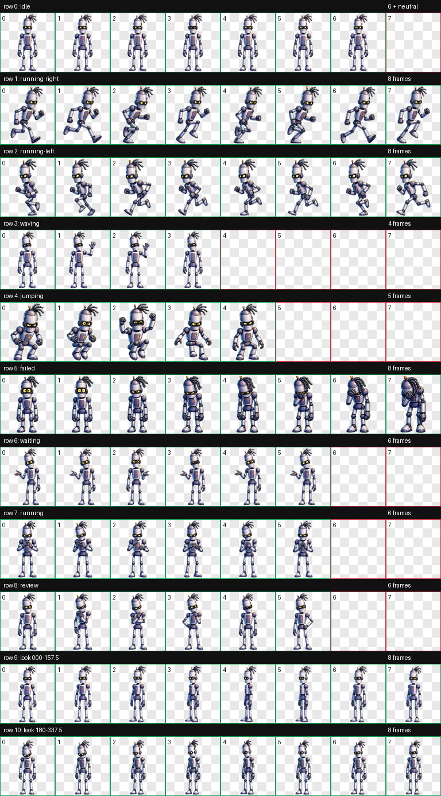

# Ботя — питомец для Codex

Ботя — анимированный питомец-маскот курса «Оно Само». Это милый робот-подросток: любопытный, немного самоуверенный, эмоциональный и надёжный.



## Что внутри

- `pet.json` — manifest питомца Codex v2;
- `spritesheet.webp` — прозрачный атлас `1536 × 2288`, 8 × 11 ячеек;
- `CHARACTER.md` — характер и визуальные правила персонажа;
- `INSTALL_PROMPT.md` — готовый промпт для безопасной установки другим агентом Codex.

В атласе есть девять стандартных состояний и шестнадцать направлений взгляда. Сборка прошла структурную, визуальную и слепую проверку кардинальных направлений.

SHA-256 `spritesheet.webp`:

```text
8275DB60E5ED1DC4CEB8E8DDBD6AFA5F30C1D09EC0BBC6807F004AF76F02AFE6
```

## Установка через Codex

1. Дайте тестировщику доступ к этому приватному репозиторию.
2. Откройте [`INSTALL_PROMPT.md`](INSTALL_PROMPT.md).
3. Скопируйте промпт целиком и отправьте его своему агенту Codex.
4. После установки полностью завершите Codex и запустите приложение снова.

Для работы питомца в каталоге Codex нужны только два файла:

```text
<CODEX_HOME>/pets/botya/pet.json
<CODEX_HOME>/pets/botya/spritesheet.webp
```

## Быстрый тест

После перезапуска выберите Ботю в селекторе питомцев и проверьте:

- спокойную idle-анимацию;
- взгляд при движении указателя вокруг питомца;
- движение влево и вправо при перетаскивании;
- рабочую анимацию во время небольшой безопасной задачи;
- ожидание ответа или подтверждения;
- реакцию на ошибку и завершение задачи.

## Статус и права

Это тестовая версия для ограниченного согласования. Лицензия и правила публичного распространения ещё не утверждены; см. [`NOTICE.md`](NOTICE.md).
